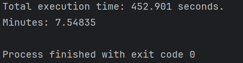

# Macedonian Stock Exchange Data Analyzer

- [Опис на проектот.](опис.pdf)
- [Спецификација на барања и кориснички сценарија.](спецификација-на-барања.pdf)

## Технологии и алатки
- **Програмски јазик:** `Java`
- **Алати за автоматизација:** `Selenium`, `Jsoup`
- **Чување на податоци:** `CSV`
- **Архитектура:** `Pipe and Filter`
  
## Инсталација

### Проверка на верзијата на Chrome
1. Отворете Chrome -> Кликнете на трите точки -> Help -> About Chrome.
   - Пример верзија: `125.0.6422.176`

### Потребни зависности
- **Selenium 4.23.1** ако верзијата на Chrome започнува со `125`, `126` или `127`
- **Selenium 4.26.0** ако верзијата на Chrome започнува со `85`, `128`, `129` или `130`
- **JSoup 1.18.1**
- **Chromedriver**

### Конфигурација
1. Додавање на Selenium:
   - `Project Structure` -> `Libraries` -> `+` -> `Java` -> `path/to/selenium-java(version)` -> OK
2. Додавање на JSoup:
   - `Project Structure` -> `Libraries` -> `+` -> `Java` -> `path/to/jsoup(version)` -> OK
3. Преземете `chromedriver.exe` за вашата верзија од [ChromeDriver GitHub репозиториумот](https://github.com/dreamshao/chromedriver).
   - Ставете `chromedriver.exe` во root фолдерот.
   - Оваа верзија на `chromedriver.exe` е за верзијата 125.

## Употреба

Стартувајте ја апликацијата за автоматско преземање на податоци за акциите, обработка во CSV формат, и одржување на податоците ажурирани. Овие податоци се подготвени за понатамошна анализа или визуелизација во било кој софтвер за обработка на податоци.

## Време на извршување
 
7.5 минути да се земат сите податоци.
